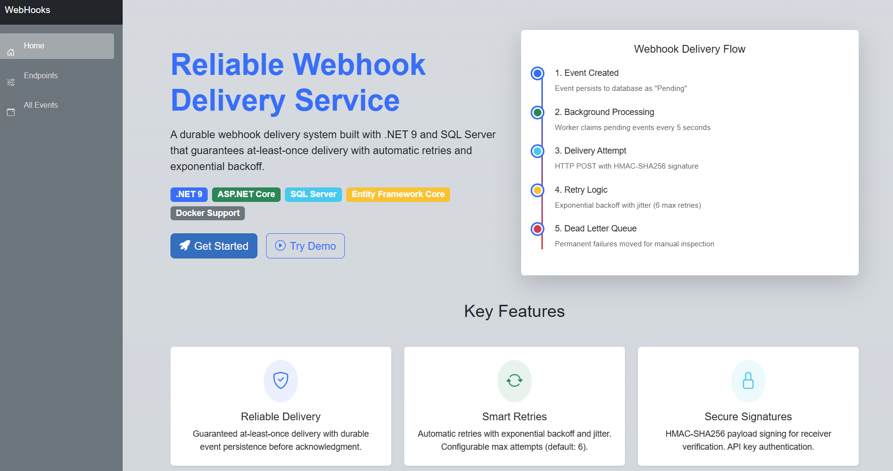

# Reliable Webhook Delivery Service


A durable webhook delivery system built with .NET 9 and SQL Server that guarantees at-least-once delivery with automatic retries and exponential backoff.
# WEBSITE DEMO


[Live Demo](https://webhook-delivery-b6bshhhtg4gyf5gm.canadacentral-01.azurewebsites.net)

## Table of Contents

- [About](#about)
- [Features](#features)
- [Tech Stack](#tech-stack)
- [Architecture](#architecture)
- [Project Structure](#project-structure)
- [Getting Started](#getting-started)
- [Configuration](#configuration)
- [API Reference](#api-reference)
- [Authentication](#authentication)
- [Testing](#testing)
- [Security Considerations](#security-considerations)
- [License](#license)

## About

This service solves the problem of reliable event delivery to external endpoints. When your system needs to notify third-party services about events, network failures, timeouts, and service outages can cause lost notifications. This project implements a durable queue pattern in SQL Server with retry logic to ensure webhooks are delivered even when failures occur.

**Problem it solves:** Unreliable webhook delivery leading to data inconsistency between systems.

**Approach:** Persist events before acknowledging, process asynchronously with retries, and move permanently failed events to a dead letter queue for manual inspection.

## Features

- [x] Webhook endpoint registration with secret management
- [x] Durable event persistence before acknowledgment
- [x] Automatic retries with exponential backoff and jitter (6 max retries)
- [x] HMAC-SHA256 payload signing for receiver verification
- [x] Dead letter queue for failed deliveries
- [x] Delivery status tracking and reporting
- [x] Concurrent processing with row-level locking
- [x] API key authentication for secure access
- [x] Background worker for continuous delivery processing
- [x] Toggle endpoint active/inactive status

## Tech Stack

| Layer | Technology |
|-------|------------|
| Framework | .NET 9 |
| Web | ASP.NET Core Web App (Razor Pages) |
| Database | SQL Server |
| ORM | Entity Framework Core 9 |
| Background Jobs | IHostedService |
| Authentication | API Key Middleware |

## Architecture

```
┌─────────────────────────────────────────────────────┐
│  UI (Razor Pages)                                   │
│  /endpoints, /endpoints/{id}/events                 │
├─────────────────────────────────────────────────────┤
│  API Controllers (JSON)                             │
│  /api/endpoints, /api/events, /api/deadletter       │
├─────────────────────────────────────────────────────┤
│  API Key Middleware                                 │
├─────────────────────────────────────────────────────┤
│  Services (Business Logic)                          │
│  DeliveryService, WebHookService                    │
├─────────────────────────────────────────────────────┤
│  Repositories (Data Access)                         │
│  IWebHookRepo, IDeliveryService                     │
├─────────────────────────────────────────────────────┤
│  Entity Framework Core + DbContext                  │
├─────────────────────────────────────────────────────┤
│  SQL Server                                         │
└─────────────────────────────────────────────────────┘

Background Worker (DeliveryWorker)
    ↓ Every 5 seconds
    Claims pending events → Delivers via HTTP → Updates status
```

### Delivery Flow

```
User creates event → Saved to DB as "Pending"
                            ↓
Background worker claims it → Attempts HTTP POST with HMAC signature
                            ↓
Success (2xx)?  → Status = "Delivered"
                            ↓
Failed?         → Increment attempt, calculate next retry (exponential backoff)
                            ↓
Max retries (6) exceeded? → Status = "DeadLetter"
```

## Project Structure

```
WebhookService/
├── WebHooks/                              # ASP.NET Core Web App
│   ├── Components/
│   │   ├── Pages/
│   │   │   ├── Endpoints.razor + .cs      # Endpoint management UI
│   │   │   ├── EndpointEvents.razor + .cs # Events for specific endpoint
│   │   │   └── Home.razor                 # Landing page
│   │   └── Layout/
│   ├── Controllers/
│   │   └── WebHookApiController.cs        # REST API endpoints
│   ├── Middleware/
│   │   └── ApiKeyMiddleware.cs            # API key authentication
│   ├── Workers/
│   │   └── DeliveryWorker.cs              # Background delivery processor
│   └── Program.cs
│
├── WebHooks-System-Library/               # Class Library (BLL, DAL)
│   ├── Data/
│   │   └── WebhooksDeliveryContext.cs     # EF Core DbContext
│   ├── Entities/
│   │   ├── WebhookEp.cs                   # Endpoint entity
│   │   ├── WebhookEvent.cs                # Event entity
│   │   └── WebhookStatus.cs               # Status enum
│   ├── Repositories/
│   │   ├── IDeliveryService.cs            # Delivery interface
│   │   └── IWebHookRepo.cs                # Repository interface
│   ├── Services/
│   │   ├── DeliveryService.cs             # HTTP delivery, signing, retries
│   │   └── WebHookService.cs              # Data access implementation
│   └── WebhookExtensions.cs               # DI registration
│
├── tests/
│   └── WebHooks.Tests/                    # Future implementation
└── README.md
```

## Getting Started

### Prerequisites

- .NET 9 SDK
- SQL Server 2019+ or SQL Server LocalDB
- Docker (optional, for containerized SQL Server)

### Installation

1. Clone the repository
```bash
git clone https://github.com/abhinavsingh1311/webhook-delivery-service.git
cd webhook-delivery-service
```

2. Set up the database
```bash
cd WebHooks
dotnet ef database update
```

3. Run the application
```bash
dotnet run
```

The application will be available at `https://localhost:7068`.

## Configuration

Update `appsettings.json` with your settings:

```json
{
  "ConnectionStrings": {
    "WebhooksDeliveryDatabase": "Server=.;Database=Webhooks-Delivery;Trusted_Connection=true;TrustServerCertificate=true;"
  },
  "WebhookSettings": {
    "MaxRetryAttempts": 6,
    "BatchSize": 10,
    "PollingIntervalSeconds": 5
  }
}
```

## API Reference

### Register Endpoint (Public - No API Key Required)
```
POST /api/endpoints
Content-Type: application/json

{
    "name": "My Webhook",
    "url": "https://example.com/webhook",
    "secret": "your-secret-key"
}

Response:
{
    "id": 1,
    "name": "My Webhook",
    "url": "https://example.com/webhook",
    "isActive": true,
    "createdAt": "2025-01-01T00:00:00Z",
    "apiKey": "abc123..."  // Save this!
}
```

### Send Event
```
POST /api/events
X-API-Key: your-api-key
Content-Type: application/json

{
    "eventPointId": 1,
    "eventType": "order.created",
    "payload": "{\"orderId\": 123}"
}

Response:
{
    "eventId": 5,
    "endpointId": 1,
    "eventType": "order.created",
    "status": "Pending"
}
```

### Check Delivery Status
```
GET /api/events/{id}/status
X-API-Key: your-api-key

Response:
{
    "id": 5,
    "status": "Delivered",
    "attemptCount": 1,
    "lastResponsecode": 200,
    "lastAttemptAt": "2025-01-01T00:00:05Z",
    "deliveredAt": "2025-01-01T00:00:05Z",
    "lastErrorMessage": null
}
```

### View Dead Letter Queue
```
GET /api/deadletter
X-API-Key: your-api-key

Response:
[
    {
        "id": 3,
        "eventType": "payment.failed",
        "status": "DeadLetter",
        "attemptCount": 6,
        "lastErrorMessage": "Connection refused"
    }
]
```

### Toggle Endpoint Status
```
PATCH /api/endpoints/{id}/toggle
X-API-Key: your-api-key

Response:
{
    "id": 1,
    "isActive": false
}
```

## Authentication

API endpoints are protected using API key authentication.

### How It Works

1. Register an endpoint via `POST /api/endpoints` (no key required)
2. Receive your API key in the response
3. Include `X-API-Key` header in all subsequent requests

### Middleware Flow

```
Request → Is /api route? → No → Pass through
              ↓ Yes
         Is POST /api/endpoints? → Yes → Pass through (public registration)
              ↓ No
         Has X-API-Key header? → No → 401 Unauthorized
              ↓ Yes
         Valid API key? → No → 401 Unauthorized
              ↓ Yes
         Process request
```

## Testing

### Using Swagger

Navigate to `https://localhost:7068/swagger` to access the interactive API documentation.

### Using Postman

1. **Register endpoint:**
   - POST `https://localhost:7068/api/endpoints`
   - Body: `{"name": "Test", "url": "https://webhook.site/your-id", "secret": "test"}`
   - Save the returned `apiKey`

2. **Send event:**
   - POST `https://localhost:7068/api/events`
   - Header: `X-API-Key: your-api-key`
   - Body: `{"eventPointId": 1, "eventType": "test", "payload": "{}"}`

3. **Verify delivery:**
   - Check [webhook.site](https://webhook.site) for incoming requests
   - GET `https://localhost:7068/api/events/{id}/status`

### Testing Failure Scenarios

Create an endpoint with an invalid URL to test retry logic:

```json
{
    "name": "Failing Endpoint",
    "url": "https://invalid-url-that-does-not-exist.com/webhook",
    "secret": "test"
}
```

Watch the event retry 6 times with exponential backoff, then move to dead letter queue.

## Security Considerations

**Note:** This is a demonstration project. For production deployment, consider:

- [ ] User authentication (Identity/OAuth) for UI pages
- [ ] Multi-tenant data isolation (users only see their own endpoints/events)
- [ ] Rate limiting on API endpoints
- [ ] API key rotation mechanism
- [ ] Encrypted storage for secrets
- [ ] Audit logging

## Webhook Signature Verification

Receivers can verify webhook authenticity using the HMAC-SHA256 signature:

```csharp
// Receiver side verification
public bool VerifySignature(string payload, string secret, string signature)
{
    using var hmac = new HMACSHA256(Encoding.UTF8.GetBytes(secret));
    var hash = hmac.ComputeHash(Encoding.UTF8.GetBytes(payload));
    var computed = $"sha256={Convert.ToHexString(hash).ToLower()}";
    return signature == computed;
}
```

Headers sent with each webhook:
- `X-Webhook-Signature`: HMAC-SHA256 signature
- `X-Webhook-Event`: Event type (e.g., "order.created")

## License

Distributed under the [MIT License](LICENCE). See `LICENSE` for more information.
